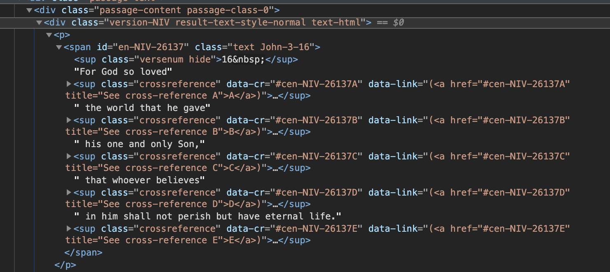

# virtual-summer-camp

Using John 3:16 as an example.

## Straight Plaintext 
This is John 3:16 in monospaced font. Green text on black background for extra hacker cred.

```
For God so loved the world that he gave his one and only Son,
that whoever believes in him shall not perish but have eternal
life.
```

## Binary
Same passage, but represented as UTF-8 binary (e.g. how the computer actually stores the text)

```
010001100110111101110010001000000100011101101111011001000010000001110011011011
110010000001101100011011110111011001100101011001000010000001110100011010000110
010100100000011101110110111101110010011011000110010000100000011101000110100001
100001011101000010000001101000011001010010000001100111011000010111011001100101
001000000110100001101001011100110010000001101111011011100110010100100000011000
010110111001100100001000000110111101101110011011000111100100100000010100110110
111101101110001011000010000001110100011010000110000101110100001000000111011101
101000011011110110010101110110011001010111001000100000011000100110010101101100
011010010110010101110110011001010111001100100000011010010110111000100000011010
000110100101101101001000000111001101101000011000010110110001101100001000000110
111001101111011101000010000001110000011001010111001001101001011100110110100000
100000011000100111010101110100001000000110100001100001011101100110010100100000
011001010111010001100101011100100110111001100001011011000010000001101100011010
01011001100110010100101110
```

## Hexadecimal Representation

Same passage, but now represented in hexadecimal form. This is how binary data is usually displayed when you open it up in a text editor.

```
466f7220476f6420736f206c6f7665642074686520776f726c6420746861742068652067617665
20686973206f6e6520616e64206f6e6c7920536f6e2c20746861742077686f657665722062656c
696576657320696e2068696d207368616c6c206e6f742070657269736820627574206861766520
657465726e616c206c6966652e
```

## Base64 Encoding
This is how binary data is usually displayed when you send unformatted stuff over the Internet.

```
Rm9yIEdvZCBzbyBsb3ZlZCB0aGUgd29ybGQgdGhhdCBoZSBnYXZlIGhpcyBvbmUgYW5kIG9ubHkgU2
9uLCB0aGF0IHdob2V2ZXIgYmVsaWV2ZXMgaW4gaGltIHNoYWxsIG5vdCBwZXJpc2ggYnV0IGhhdmUg
ZXRlcm5hbCBsaWZlLg==
```

## Python Pseudocode
A humorous attempt by me to represent John 3:16 as a Python program, if God is a Python developer (which He probably is because Python can do anything)

```
from universe import World
from heaven import God, Son, Heaven

if God.loves(World) == True:
    World += Son

for person in World:
    if person.believes(Son):
        person.perish = False
        Heaven += person
```

## BibleGateway HTML
This is the how Biblegateway delivers John 3:16 in its HTML form.

